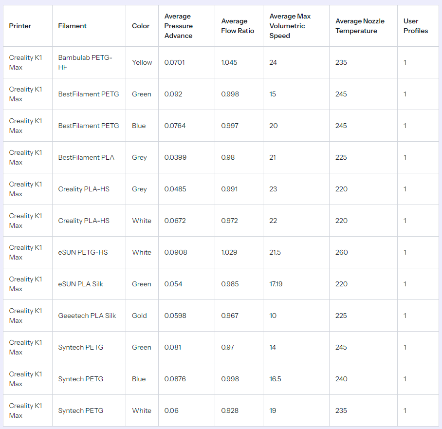

# 3D Filament Settings

## Installation

```bash
composer install
npm install

composer migrate
composer operations
```

After that, you need to run the following commands on your local computer:

```bash
php artisan orca-slicer:import

# to run dev server
composer dev
```

### Development

Create the `routes/playground.php` file and insert the following data into it:

```php
use App\Data\OrcaSlicer\FilamentData;
use App\Models\Machine;
use App\Models\User;
use App\Services\OrcaSlicer\UserProfileService;
use Illuminate\Support\Facades\Artisan;
use Illuminate\Support\Facades\File;

Artisan::command('foo', function () {
    $files = File::allFiles(
        storage_path('app/private')
    );

    $service = app(UserProfileService::class);

    $user = User::firstWhere('email', 'your-email@example.com');

    $machine = Machine::firstWhere('slug', 'k1-max');

    foreach ($files as $file) {
        if ($file->getExtension() !== 'json') {
            continue;
        }

        $content = file_get_contents($file->getRealPath());

        $profile = FilamentData::from($content);

        dump(
            $profile->externalId
        );

        $service->import($user, $machine, $profile);
    }
});
```

## List


